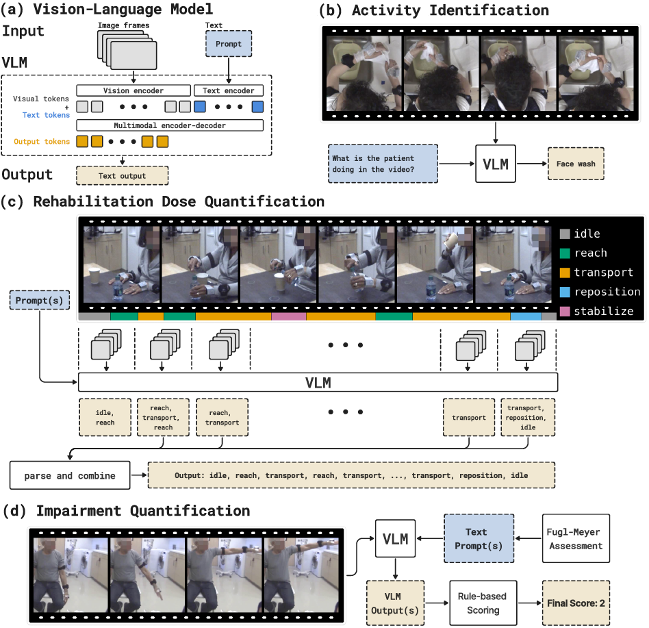
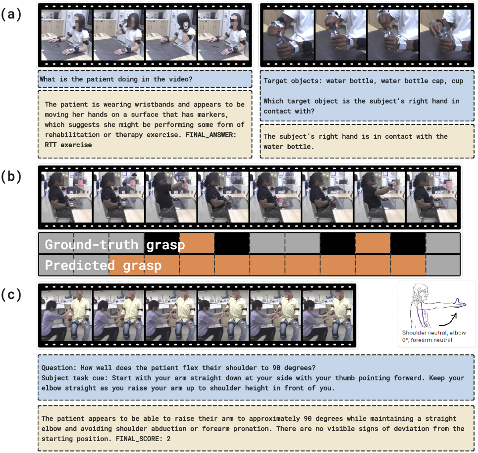

# The Potential and Limitations of Vision-Language Models for Human Motion Understanding: A Case Study in Data-Driven Stroke Rehabilitation

**[ai@nyu](https://cims.nyu.edu/ai/areas/ai-for-healthcare-and-medicine/)**

[[`Paper`](https:XXX)] [[`Project`](https://XXX)] [[`BibTeX`](#citing-cvfm4rehab)]

> Abstract: Vision–language models (VLMs) have demonstrated remarkable performance across a wide range of computer-vision tasks, sparking interest in their potential for digital health applications. Here, we apply VLMs to two fundamental challenges in data-driven stroke rehabilitation: automatic quantification of rehabilitation dose and impairment from videos. We formulate these problems as motion-identification tasks, which can be addressed using VLMs. We evaluate our proposed framework on a cohort of 29 healthy controls and 51 stroke survivors. Our results show that current VLMs lack the fine-grained motion understanding required for precise quantification: dose estimates are comparable to a baseline that excludes visual information, and impairment scores cannot be reliably predicted. Nevertheless, several findings suggest future promise. With optimized prompting and post-processing, VLMs can classify high-level activities from a few frames, detect motion and grasp with moderate accuracy, and approximate dose counts within 25% of ground truth for mildly impaired and healthy participants, all without task-specific training or finetuning. These results highlight both the current limitations and emerging opportunities of VLMs for data-driven stroke rehabilitation and broader clinical video analysis.




### Reproducing the Results

**Installation**

```bash
git clone https://github.com/livctr/cvfm4rehab.git
cd cvfm4rehab
git submodule update --init --recursive
bash ./setup_cvfm4rehab_envs.sh [-y]
```

The bash script `./setup_cvfm4rehab_envs.sh` creates four separate environments `cvfm4rehab`, `cvfm4rehab_llava`, `cvfm4rehab_vila`, and `cvfm4rehab_longva` for running different models. Add the `-y` flag to say "yes to all prompts". Alternatively, you can choose which environment to create based on the models you plan to use.

| Environment | Models |
|-------------|--------|
| `cvfm4rehab` | qwen2_5_vl_[7,32,72]b |
| `cvfm4rehab_llava` | internvl3p5_[2,8,38,30b_a3]b, internvl3_78b, llava_next_video_[7,72]b, llava_ov_[0p5,7,72]b |
| `cvfm4rehab_vila` | nvila_[8,15]b, longvila_8b |
| `cvfm4rehab_longva` | longva_7b |

**Running an Experiment**

```bash
# (1) Manually fill in appropriate API keys / sbatch directive in `evaluate.sh.example`.
# (2) Run the following command
bash evaluate.sh.example --model [models] --task [tasks]
```

Replacements for [models]:
- One model: `qwen2_5_vl_7b`, `qwen2_5_vl_32b`, `qwen2_5_vl_72b`, `llava_ov_0p5b`, `llava_ov_7b`, `llava_ov_72b`, `llava_next_video_7b`, `llava_next_video_72b`, `internvl3p5_2b`, `internvl3p5_8b`, `internvl3p5_38b`, `internvl3_78b`, `internvl3p5_30b_a3b`, `internvl3p5_241b_a28b`, `longva_7b`, `nvila_8b`, `nvila_15b`
- Aliases: `small`, `medium`, `big`. Runs all models of size up to $\sim 8\text{B}$, $\sim 15\text{B}$ to $38\text{B}$, and $\sim 72\text{B}$ or larger parameters, respectively.
- Alias: `all`. Runs all available models.
- You can also run multiple models, comma-separated, as such: `qwen2_5_vl_7b,qwen2_5_vl_32b,qwen2_5_vl_72b`

Replacements for [tasks]
- Choose which task to evaluate the VLM on. The task yaml files are under "lmms_eval/tasks/strokerehab/" with important choices listed below. The letters corrspond to those found on the right side of Table 1.
- (A) Activity Identification: Ask a VLM to identify which one of nine activities is depicted in a video. See "postprocess/id/identification.ipynb" for results.
  - `strokerehab_identification_1`: prompt with pre-existing descriptions of the activities.
  - `strokerehab_identification_2`: use optimized prompts.
- (B) Dose Quantification: Ask a VLM to identify one of five fine-grained actions for each $0.533$-s video segment. See "postprocess/primitives/exp_to_latex.ipynb".
  - `strokerehab_primitives_1`, `strokerehab_primitives_2`: not explored much. The first requests the VLM to output multiple actions (since there could be $>1$ per segment), while the second requests the VLM to classify one action directly.
  - `strokerehab_primitives_3`: explored in the paper. Breaks down the fine-grained actions along two axes: motion and grasp. This strategy prompts the VLM to output one answer for each axis and uses rule-based methods to reconstruct the action (two of the actions are distinguished based on a grasp in the immediate future).
- (C) Dose Quantification RTT/Shelf: Same as above, but with a different dataset consisting of videos with more regular motions. See "postprocess/primitives/counting.ipynb" for results. You should run `bash evaluate.sh --model qwen2_5_vl_prim --task strokerehab_counting --model_args "do_crop=True,do_postprocess=True"`. Here, `qwen2_5_vl_prim` runs Qwen2.5-VL-32B-Instruct with optimized prompting.
- (D) Impairment Quantification: Ask a VLM to rate a subject's impairment level. See "postprocess/ia/eval.ipynb" for results.
  - `strokerehab_ia2_3_30,strokerehab_ia2_31_33`: Ask the VLM a bunch of questions per item (numbered 3 through 33) and use rules to determine the final item-level score (0, 1, or 2).
  - `strokerehab_ia4_3_30,strokerehab_ia4_31_33`: Prompt the VLM in a Chain-of-Thought manner and parse its final answer.
  
Running ablations
- `evaluate.sh.example` also allows the model and task arguments to be replaced. Please ensure that both argument types are written in or else things might break.
- Example: `bash evaluate.sh.example --model qwen2_5_vl_7b --task strokerehab_primitives_2 --model_args "pretrained=Qwen/Qwen2.5-VL-7B-Instruct,max_frames_num=1,sampling_strategy=dense,sampling_fps=1,overlap_frames_num=0"`


### Findings

See the [the paper](#the-potential-and-limitations-of-vision-language-models-for-human-motion-understanding-a-case-study-in-data-driven-stroke-rehabilitation) for further quantitative results!




## Citing cvfm4rehab

Coming soon.
<!-- ```bibtex
@article{li2025cvfm4rehab,
  title        = {The Potential and Limitations of Vision-Language Models for Human Motion Understanding: A Case Study in Data-Driven Stroke Rehabilitation},
  author       = {Li, Victor and Kamalakannan, Naveen and Parnandi, Avinash and Schambra, Heidi and Fernandez-Granda, Carlos},
  journal      = {XXX},
  year         = {2025}
}
``` -->